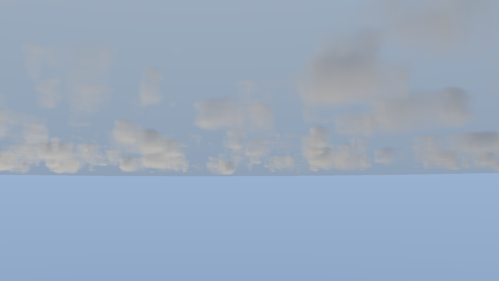
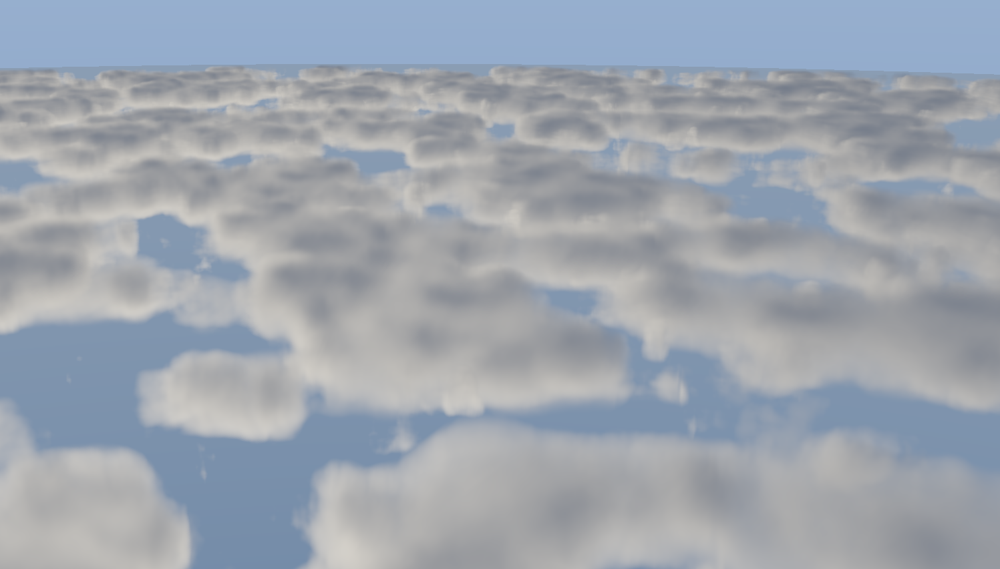
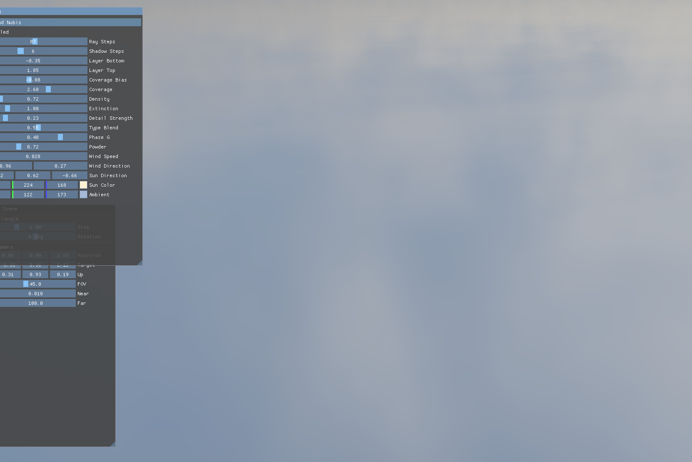
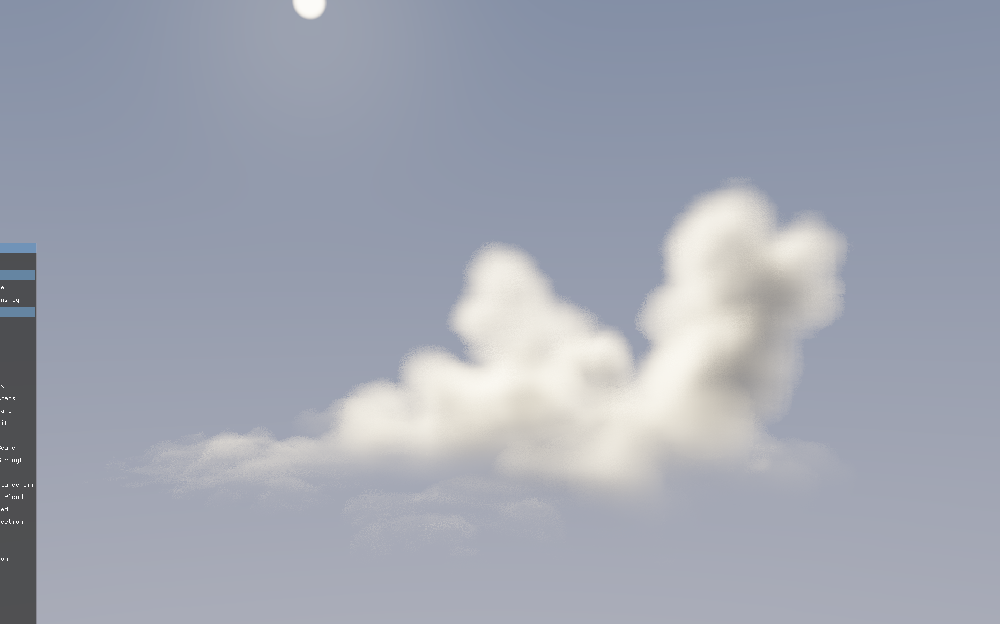
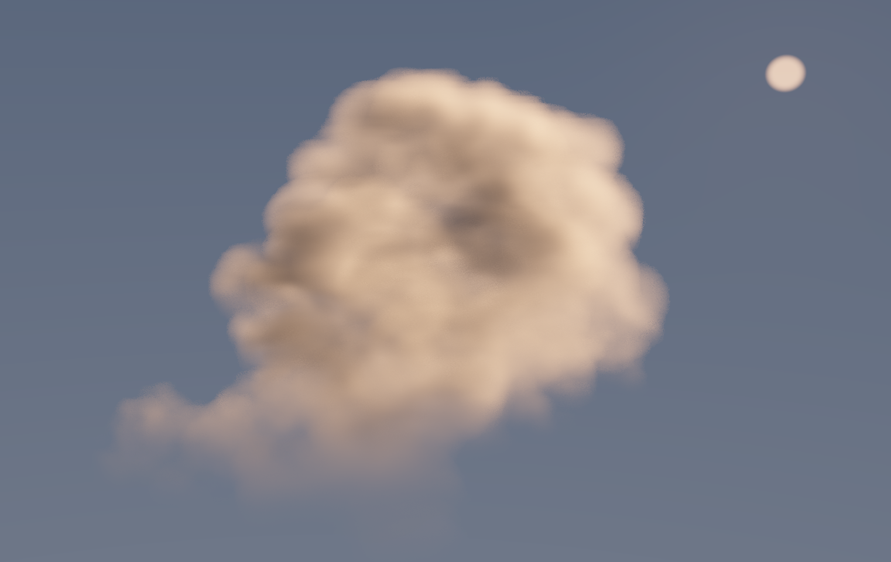

# Aerkanis
An Real-time implementation of https://www.guerrilla-games.com/read/nubis-cubed, a highly detailed and immersive voxel-based cloud renderer and modeling approach by Guerrilla Games, with Vulkan and Slang.

The name, **Aerkanis**, is composed of **Aer**(air/atmosphere) + vul**kan** + nub**is** ).

## Overview
### Tech Stack
* **Graphics API:** Vulkan 1.4 (With Modern RAII)
* **Shading Language:** Slang
* **Language:** C++ 

## Capture
- nubis

|  |  |
| ------------------------------------------------------------ | ------------------------------------------------------------ |
|  |  |

- nubis3(cubed)

|  |  |
| ------------------------------------------------------------ | ------------------------------------------------------------ |

